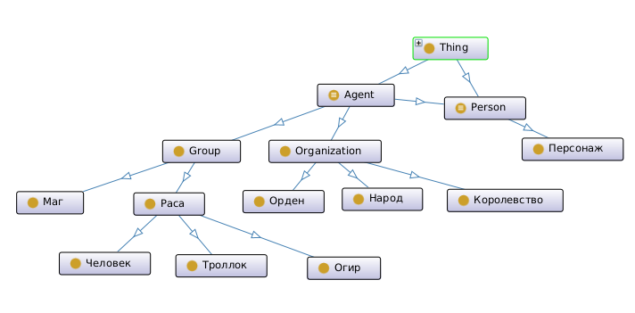
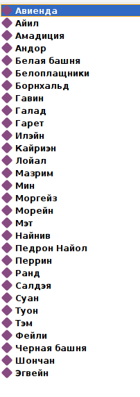
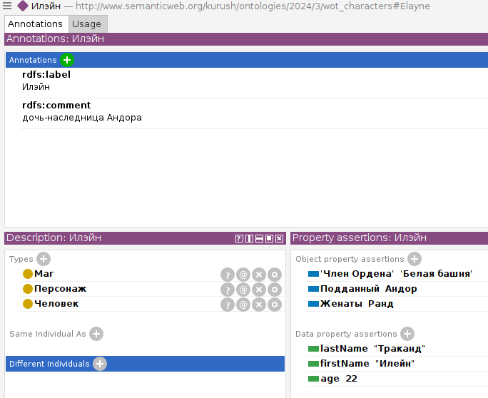
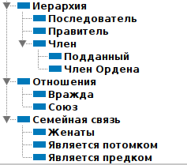
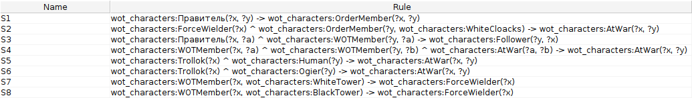
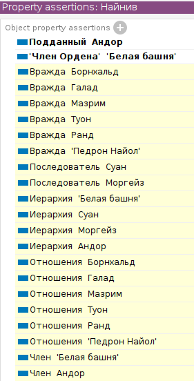
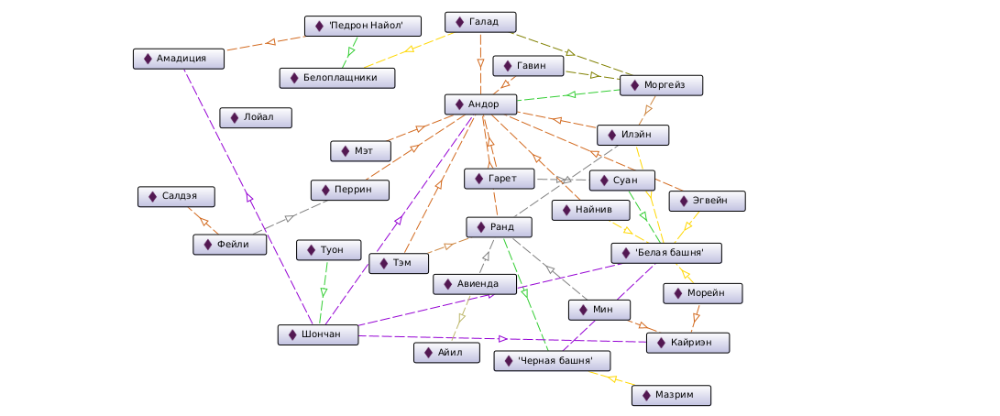
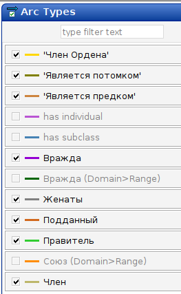

# Лабораторная №3 [Онтологии]

## Ключевые моменты:
- для создания онтологии юыло использовано ПО Protege
- тематика: описание персонажей книжного цикла "Колесо Времени" (в меру вольное, без детализации и фанатичного следования канону)
- использованные базовые онтологии: rdfs (проставление меток и комментариев), foaf (базовые классы групп и акторов, атрибуты классов)

## Краткое описание онтологии

### Классы

В качестве базовых классов были взяты Agent, Group и Person из foaf.
Соответственно, основные введенные классы - персонаж, королевство, орден и раса,
часть из них - со своими подклассами. 

На схеме приведены используемые классы и непорочащие их родственные связи

### Сущности

В строгом соответствии с заявленными темой онтологии и набором классов
был описан ряд ключевых персонажей и полит. организаций, список приведен прямо здесь:

Пример описания персонажа, включая набор характеризующих его классов,
а также атрибутов и отношений:

### Отношения

Иерархия созданных отношений приведена ниже. Среди них есть функциональные (подданный),
транзитивные (является потомком/предком), обратно-функциональные (правитель), симметричные (вражда):

### Правила

Способ описать правила искался-искался... и наконец нашелся! было создано 
8 SWRL-правил, характеризующих особенности построения связей и позволяющие автоматически
выводить более сложные отношения.

Например: если человек X принадлежит к ордену Белоплащников, то он по умолчанию
враждует с любым, кто владеет магией.

Ниже приведен пример автоматического вывода отношений для персонажа. 
Белым отмечены самостоятельно введенные отношения, желтым - выведенные.

## Итоговый граф

Граф связей между сущностями (только заданные, не вычисленные), а также легенда
с сопоставлением цвета ребра и обозначаемого отношения:

